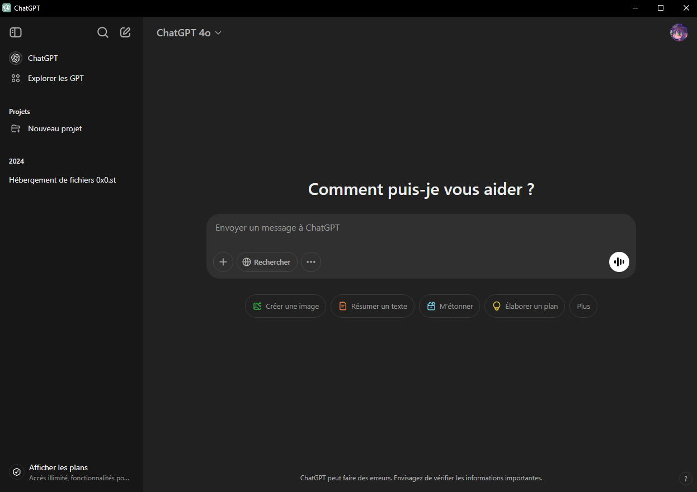

<h1 align="center">ChatGPT_Desktop </h1>

> 🖥️ ChatGPT_Desktop est une application de bureau conçue pour offrir une expérience optimisée de ChatGPT.




## 🚀 Usage

Pour utiliser ce projet, suivez les étapes ci-dessous dans votre terminal préféré.

### 1️⃣ Installation des Dépendances

Avant toute chose, installez les dépendances nécessaires :

```shell
npm install
```

Note: Cette étape est obligatoire avant de construire ou d'exécuter l'application `npm start`.

### 2️⃣ Construction et Exécution

#### 🔹 Windows

1. Exécutez la commande suivante pour construire le dossier `ChatGPT-win32-x64/` :

```
npm run build-win
```

2. Vous pourrez exécuter l'application en lançant `ChatGPT.exe` à l'intérieur de ce dossier.

#### 🔹 MAC

1. Exécutez la commande suivante pour construire le dossier `ChatGPT-darwin-x64/` :

```shell
npm run build-mac
```

2. Copiez l'application dans `/Applications/` pour qu'elle apparaisse dans le Launchpad :

```shell
sudo cp -R ChatGPT-darwin-x64/ChatGPT.app /Applications/
```

3. Vous pourrez ensuite exécuter `ChatGPT` directement depuis le Launchpad.


## 👤 Author

Give a ⭐️ if this project helped you!

## 📝 License

Copyright © 2025 [Macxzew](https://github.com/Macxzew).<br />
This project is [MIT](https://github.com/Macxzew/ChatGPT_Desktop/blob/main/LICENSE) licensed.
